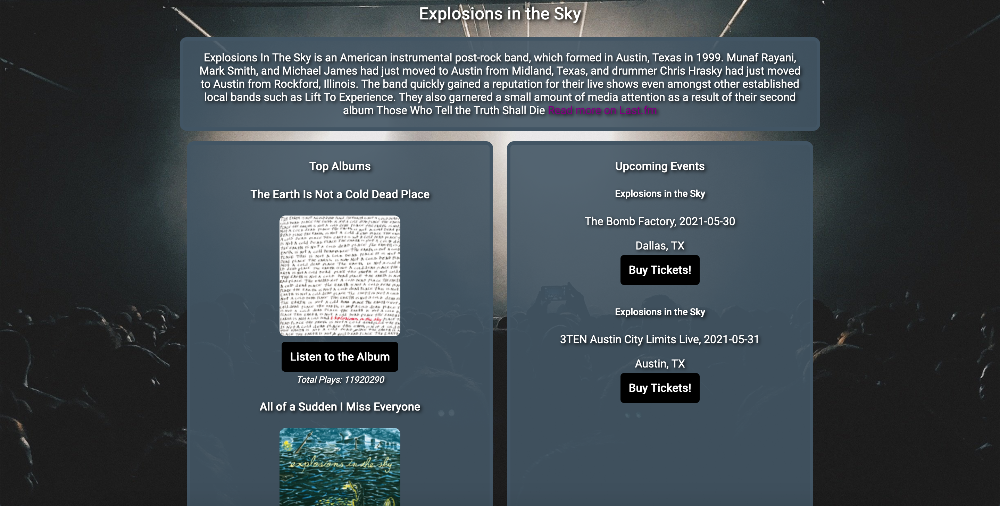

# Musiciandex: The Musician Index

## Live Demo
https://zacharyjameson.github.io/musiciandex/

## Motivation 
I wanted to build a place where users could both check in on upcoming events as well as get information on background and most listened to albums of users' favorite artists as well as a tool to get a snapshot view of artists they haven't listened to yet.

## Summary
Users are able to enter in a band, artist or musician name and Musiciandex will return the respective description of the input, upcoming events and top 3 albums of the respective artist. 

Landing Page:

Searched Musician:

## Built With
* HTML
* CSS
* JavaScript
* jQuery

## Features
* Search for a musician/band
* Read through their bio/description, check out their top albums and any upcoming concerts/events they're having.

